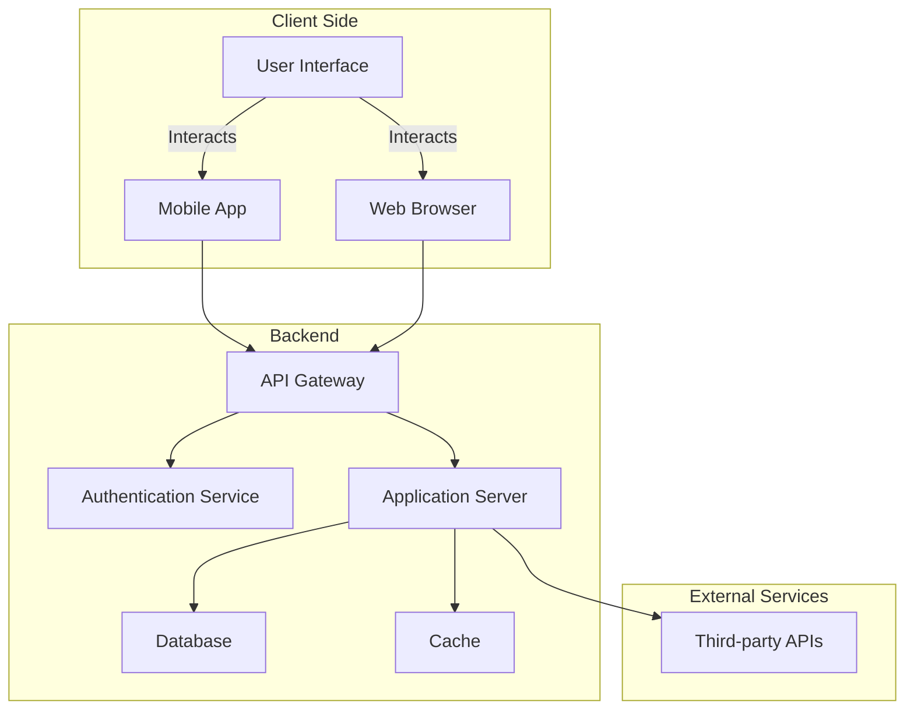

# Architecture Overview

Below is a Mermaid diagram representing a typical architecture overview. You can customize this diagram for your specific project needs.

## Legend

- **Client Side:** Interfaces where users interact with the system.
- **Backend:** Handles business logic, authentication, and data storage.
- **External Services:** Integrations with third-party APIs or platforms.

Feel free to modify the diagram for your project's architecture!